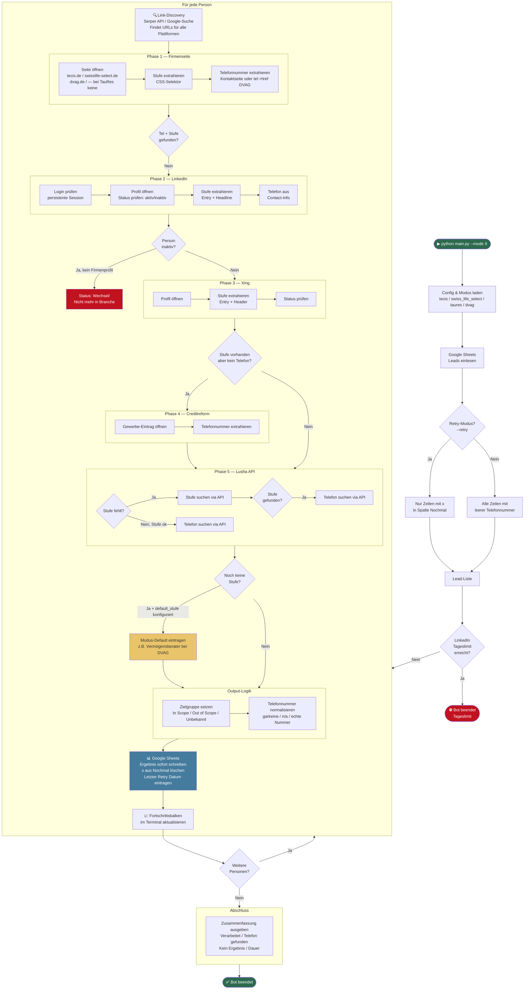

# 🤖 BK-Automatisierung: Multi-Company Berater-Scraping & Validierungs-System

<div align="center">

**Ein intelligentes Python-System zur automatisierten Extraktion und Validierung von Beraterdaten – für mehrere Unternehmen**

[](https://www.python.org/downloads/)
[](https://playwright.dev/)
[](LICENSE)

[Features](#-features) •
[Installation](#-installation) •
[Konfiguration](#-konfiguration) •
[Verwendung](#-verwendung) •
[Unternehmens-Modi](#-unternehmens-modi) •
[Architektur](#-architektur) •
[Dokumentation](#-dokumentation)

</div>

---

## 📋 Über das Projekt

Der **BK-Automatisierungs-Bot** ist ein robustes Web-Scraping-System, das automatisch Kontaktdaten (Telefonnummern) und Karrierestufen von Finanzberatern verschiedener Unternehmen extrahiert und validiert. Das System unterstützt **4 Unternehmens-Modi** und durchläuft dabei fünf priorisierte Datenquellen mit intelligenten Fallback-Mechanismen:

1. **Firmenseite** (offizielle Quelle – je nach Modus: tecis.de, dvag.de etc.)
2. **LinkedIn** (Karriere-Profil & Status-Validierung)
3. **Xing** (Karriere-Profil DE)
4. **Creditreform** (Gewerbe-Einträge)
5. **Lusha API** (Fallback für Telefonnummer & Position)

### 🎯 Hauptziele

- ✅ Automatisierte Lead-Qualifizierung anhand validierter Karrierestufen
- ✅ Extraktion von Kontaktdaten aus öffentlich zugänglichen Quellen
- ✅ Statusprüfung (Aktiv/Inaktiv) zur Lead-Qualität
- ✅ Zielgruppen-Kategorisierung (In Scope / Out of Scope)
- ✅ Vollständige Integration mit Google Sheets für Ein-/Ausgabe
- ✅ Unterstützung für 4 Unternehmens-Modi: **tecis**, **swiss_life_select**, **taures**, **dvag**
- ✅ Retry-Modus für markierte Leads (Spalte "Nochmal")

---

## ✨ Features

### 🏗️ Kern-Features

- **4-Phasen-Architektur:** Sequenzielle Datenextraktion mit intelligenten Fallbacks und Status-Flags
- **Smart Link-Discovery:** Automatische URL-Findung via Serper API oder lokaler Google-Suche (Playwright)
- **LinkedIn-Integration:** Automatischer Login mit persistenter Session-Verwaltung und 2FA-Support
- **Rate-Limiting:** Konfigurierbare Limits für alle Plattformen (Tages-/Stunden-Limits, Pausen)
- **Google Sheets API:** Direkte Ein-/Ausgabe, automatische Fortsetzung nach Abbruch
- **Stufen-Validierung:** Whitelist-basierte Validierung mit 15 definierten Karrierestufen
- **Zielgruppen-Kategorisierung:** Automatische Klassifizierung (In Scope / Out of Scope)
- **Status-Tracking:** Aktiv/Inaktiv-Prüfung über LinkedIn als "Authoritative Source"

### 🛠️ Technische Highlights

- **Robuste Selektoren:** Konfigurierbare CSS/XPath-Selektoren für einfache Wartung
- **Fehlertoleranz:** Umfangreiches Exception-Handling und Logging
- **Persistent Browser Context:** Session-Wiederverwendung für LinkedIn (keine wiederholten Logins)
- **Strukturiertes Logging:** Detaillierte Logs für Debugging und Monitoring
- **Modular & Erweiterbar:** Klare Trennung in Phasen, Discovery und I/O-Module

---

## 🚀 Quick Start

> 💡 **Neu hier?** Folge der detaillierten **[Onboarding-Anleitung](ONBOARDING.md)** für ein Schritt-für-Schritt Setup!

```bash
# 1. Repository klonen
cd "/path/to/BK Automatisierung"

# 2. Virtual Environment erstellen
python3 -m venv venv
source venv/bin/activate  # macOS/Linux
# oder: venv\Scripts\activate  # Windows

# 3. Dependencies installieren
pip install -r requirements.txt
playwright install chromium

# 4. Umgebungsvariablen konfigurieren
cp .env.example .env
# Bearbeite .env mit deinen Credentials

# 5. Bot starten – Modus wählen:
python main.py --mode tecis               # tecis Finanzdienstleistungen
python main.py --mode swiss_life_select   # Swiss Life Select
python main.py --mode taures              # TauRes
python main.py --mode dvag                # Deutsche Vermögensberatung (DVAG)

# Retry-Modus (nur Zeilen mit "x" in Spalte "Nochmal"):
python main.py --mode tecis --retry
python main.py --mode swiss_life_select --retry
python main.py --mode taures --retry
python main.py --mode dvag --retry
```

📖 **Ausführliche Anleitung:** Siehe [ONBOARDING.md](ONBOARDING.md) für detailliertes Setup mit Google Cloud, LinkedIn und Troubleshooting.

---

## 📋 Anforderungen

### System-Anforderungen
- **Python:** 3.10 oder höher
- **Betriebssystem:** macOS, Linux oder Windows
- **Browser:** Google Chrome/Chromium (wird automatisch von Playwright installiert)
- **Speicher:** Min. 2 GB RAM empfohlen
- **Festplatte:** Min. 500 MB freier Speicherplatz

### Externe Services
- **Google Cloud Console:** OAuth 2.0 Credentials für Sheets API
- **LinkedIn-Account:** Gültiges Login (Free, Premium oder Sales Navigator)
- **Serper API** *(optional)*: API-Key für Google-Suche (Alternative: lokale Playwright-Suche)

---

## 📦 Installation

### 1. Repository klonen

```bash
git clone <repository-url>
cd "BK Automatisierung"
```

### 2. Virtual Environment erstellen und aktivieren

```bash
# Virtual Environment erstellen
python3 -m venv venv

# Aktivieren (macOS/Linux)
source venv/bin/activate

# Aktivieren (Windows)
venv\Scripts\activate
```

### 3. Dependencies installieren

```bash
# Python-Pakete installieren
pip install -r requirements.txt

# Playwright Browser installieren
playwright install chromium
```

### 4. Umgebungsvariablen konfigurieren

Erstelle eine `.env`-Datei aus der Vorlage:

```bash
cp .env.example .env
```

Bearbeite die `.env`-Datei mit deinen echten Credentials:

```env
# LinkedIn Credentials
LINKEDIN_EMAIL=deine-email@example.com
LINKEDIN_PASSWORD=dein-passwort

# Google Sheets
SHEET_ID=deine-google-sheet-id

# Serper API (Optional - für Google-Suche)
SERPER_API_KEY=dein-api-key-hier

# Optional: Limits überschreiben (Defaults in config.yaml)
# LINKEDIN_MAX_PROFILES_PER_DAY=50
# LINKEDIN_MAX_PROFILES_PER_HOUR=25
```

### 5. Google Sheets API einrichten

#### 5.1 Google Cloud Console Setup

1. Gehe zur [Google Cloud Console](https://console.cloud.google.com/)
2. Erstelle ein neues Projekt (oder wähle ein bestehendes)
3. Aktiviere die **Google Sheets API**:
   - Navigation: APIs & Services → Library
   - Suche nach "Google Sheets API"
   - Klicke auf "Aktivieren"

#### 5.2 OAuth 2.0 Credentials erstellen

1. Navigation: APIs & Services → Credentials
2. Klicke auf "Credentials erstellen" → "OAuth client ID"
3. Wähle **Application type: Desktop App**
4. Name: z.B. "Tecis-Bot Desktop"
5. Klicke auf "Erstellen"
6. Download die Credentials als `credentials.json` in das Projektverzeichnis

> 💡 **Tipp:** Beim ersten Start öffnet sich ein Browser-Fenster für die OAuth-Autorisierung. Nach erfolgreicher Autorisierung wird ein `token.json` erstellt, das die Session speichert.

#### 5.3 Google Sheet vorbereiten

Die Tabelle muss folgende **Spaltenstruktur** haben (Zeile 1 = Header):

| Full Name | Company | Telefonnummer | Zweite Telefonnummer | Stufe | Zielgruppe |
|-----------|---------|---------------|---------------------|-------|-----------|
| Max Mustermann | tecis Finanzdienstleistungen AG | | | | |

**Wichtige Hinweise:**
- **Eingabe-Spalten:** `Full Name`, `Company` (müssen ausgefüllt sein)
- **Ausgabe-Spalten:** `Telefonnummer`, `Zweite Telefonnummer`, `Stufe`, `Zielgruppe` (werden vom Bot ausgefüllt)
- Der Bot verarbeitet nur Zeilen, bei denen die "Telefonnummer"-Spalte leer ist (Fortsetzung nach Abbruch)

**Sheet-ID ermitteln:**

Kopiere die Sheet-ID aus der URL:
```
https://docs.google.com/spreadsheets/d/DEINE_SHEET_ID/edit
                                        ^^^^^^^^^^^^^^^^
```

Trage die Sheet-ID in die `.env`-Datei ein.

### 6. Serper API einrichten (Optional)

Für schnellere und zuverlässigere Google-Suchen kannst du die Serper API verwenden:

1. Registriere dich auf [serper.dev](https://serper.dev)
2. Erhalte deinen kostenlosen API-Key (2.500 Suchen/Monat gratis)
3. Trage den Key in die `.env` ein: `SERPER_API_KEY=dein-key`

**Alternative:** Ohne Serper API nutzt der Bot die lokale Playwright-Google-Suche (langsamer, anfälliger für Captchas).

In `config.yaml`:
```yaml
discovery:
  use_serper: true  # true = Serper API | false = Playwright
```

## Konfiguration

### config.yaml

Die Hauptkonfiguration befindet sich in `config.yaml`:

#### Rate Limits

```yaml
limits:
  linkedin:
    max_profiles_per_day: 50      # Maximal 50 Profile pro Tag
    max_profiles_per_hour: 25     # Maximal 25 Profile pro Stunde
    delay_between_requests_min: 15 # 15-45 Sekunden Pause zwischen Requests
    delay_between_requests_max: 45
    pause_after_n_profiles: 20    # Pause nach 20 Profilen
    pause_duration: 300           # 5 Minuten Pause
  
  xing:
    max_profiles_per_hour: 30
    delay_between_requests_min: 2
    delay_between_requests_max: 5
```

**Wichtig:** Die LinkedIn-Limits hängen von deinem Account-Typ ab:
- Free Account: 50-80 Profile/Tag
- Premium: 100-150 Profile/Tag
- Sales Navigator: bis 250 Profile/Tag

Passe die Limits entsprechend an!

#### Gültige Stufen pro Modus

Die Stufen-Listen sind pro Unternehmens-Modus in `config.yaml` definiert:

```yaml
companies:
  tecis:
    stufen:
      in_scope:
        - "Sales Consultant"
        - "Teamleiter"
        # ...
      out_of_scope:
        - "Trainee"
        # ...
  dvag:
    stufen:
      in_scope:
        - "Direktionsleiter"
        - "Agenturleiter"
        - "P5"
        # ...
      out_of_scope: []  # Alles andere = Unbekannt
```

> 💡 **Neue Stufe hinzufügen:** Einfach den Positionsnamen unter `in_scope` oder `out_of_scope` beim entsprechenden Modus in `config.yaml` eintragen.

---

## 🎮 Verwendung

### Bot starten

```bash
# Virtual Environment aktivieren (falls nicht bereits aktiv)
source venv/bin/activate  # macOS/Linux
# venv\Scripts\activate  # Windows
```

#### Alle verfügbaren Befehle

```bash
# ── Normaler Lauf (verarbeitet alle neuen/unverarbeiteten Zeilen) ──────────────
python main.py --mode tecis               # tecis Finanzdienstleistungen
python main.py --mode swiss_life_select   # Swiss Life Select
python main.py --mode taures              # TauRes
python main.py --mode dvag                # Deutsche Vermögensberatung (DVAG)

# ── Retry-Modus (nur Zeilen mit "x" in Spalte "Nochmal") ─────────────────────
python main.py --mode tecis --retry
python main.py --mode swiss_life_select --retry
python main.py --mode taures --retry
python main.py --mode dvag --retry
```

> 💡 **Retry-Modus:** Trage ein `x` in die Spalte **"Nochmal"** bei den gewünschten Personen ein. Der Bot verarbeitet dann nur diese Zeilen erneut und löscht das `x` danach automatisch. In Spalte **"Letzter Retry"** wird Datum und Uhrzeit eingetragen.

---

### Was der Bot macht

1. ✅ Lädt Leads aus Google Sheets (nur unverarbeitete Zeilen, oder bei `--retry` nur markierte)
2. 🔍 Findet URLs über Serper API oder lokale Google-Suche
3. 🤖 Verarbeitet jeden Lead durch bis zu 5 Phasen
4. 📊 Schreibt Ergebnisse sofort nach jeder Person in Google Sheets
5. 🛡️ Beachtet Rate-Limits und pausiert automatisch
6. 📈 Zeigt Fortschrittsbalken und Abschluss-Zusammenfassung im Terminal

---

### Terminal-Ausgabe

```
================================================================================
Company-Bot startet im Modus: dvag...
Firma: DVAG
================================================================================
✓ 25 Lead(s) erfolgreich geladen
✓ LinkedIn Rate-Limit OK - Verarbeitung kann starten
================================================================================
Starte Lead-Verarbeitung...
================================================================================
[1/25] Verarbeite: Max Mustermann
--- Phase 1: DVAG ---
--- Phase 2: LinkedIn ---
[1/25] ✓ In Tabelle geschrieben
  Fortschritt: [████░░░░░░░░░░░░░░░░] 1/25 (4%) | ⏱ ~48 min verbleibend
...
================================================
  VERARBEITUNG ABGESCHLOSSEN
================================================
  Verarbeitet:             25 Personen
  Telefonnummer gefunden:  18
  Kein Ergebnis:           7
  Dauer:                   52 Min 14 Sek
================================================
```

---

## 🏢 Unternehmens-Modi

Das System unterstützt 4 vorkonfigurierte Unternehmens-Modi. Jeder Modus hat eigene Karrierestufen, Selektoren und Scraping-Logik.

### `--mode tecis` — tecis Finanzdienstleistungen

| | |
|---|---|
| **Firmenseite** | `tecis.de/[name].html` |
| **Telefon-Quelle** | Kontaktseite (`/kontaktuebersicht.html`) |
| **In Scope** | Sales Consultant, Senior Sales Consultant, Sales Manager, Senior Sales Manager, Seniorberater, Teamleiter, Repräsentanzleiter, Branch Manager, Regional Manager, General Sales Manager |
| **Out of Scope** | Divisional Manager, General Manager, Juniorberater, Beraterassistent, Trainee |

---

### `--mode swiss_life_select` — Swiss Life Select

| | |
|---|---|
| **Firmenseite** | `swisslife-select.de/[name].html` |
| **Telefon-Quelle** | Kontaktseite (`/kontaktuebersicht.html`) |
| **In Scope** | Finanzberater, Teammanager, Manager, Direktor, Seniordirektor |
| **Out of Scope** | Teamleiter, Finanzberater-Trainee |

---

### `--mode taures` — TauRes

| | |
|---|---|
| **Firmenseite** | keine (kein öffentliches Profil) |
| **Telefon-Quelle** | LinkedIn, Creditreform, Lusha |
| **In Scope** | Chief Consultant, Branchmanager, Regionalmanager, Divisionalmanager, Generalmanager |
| **Out of Scope** | Senior Consultant, Junior Consultant, Trainee |
| **Besonderheit** | Unbekannte Stufen werden als validiert behandelt (`treat_unknown_as_validated: true`) |

---

### `--mode dvag` — Deutsche Vermögensberatung (DVAG)

| | |
|---|---|
| **Firmenseite** | `dvag.de/[name]/index.html` |
| **Telefon-Quelle** | Hauptseite direkt (HTML-Attribut `a[href^="tel:"]`), Fallback: `/ueber-uns.html` |
| **In Scope** | Direktionsleiter, Regionaldirektionsleiter 1/2, Hauptgeschäftsstellenleiter, Geschäftsstellenleiter, Regionalgeschäftsstellenleiter, Agenturleiter, P2–P7, Hauptberuf, Nebenberuf |
| **Unbekannt** | Vermögensberater, VBA und alle anderen → Stufe = n/a |
| **Besonderheit** | Telefonnummer wird direkt aus dem `tel:`-Href-Attribut extrahiert (kein sichtbarer Text) |

---

**Console-Output Beispiel (veraltet):**

```
================================================================================
Tecis-Bot startet...
================================================================================
✓ 15 Lead(s) erfolgreich geladen
Prüfe LinkedIn Rate-Limit Status...
✓ LinkedIn Rate-Limit OK - Verarbeitung kann starten
================================================================================
Starte Lead-Verarbeitung...
================================================================================
[1/15] Verarbeite: Max Mustermann
--- Link-Discovery ---
  ✓ Tecis URL gefunden
  ✓ LinkedIn URL gefunden
--- Phase 1: Tecis ---
  ✓ Stufe gefunden: Senior Sales Manager
  ✓ Telefonnummer gefunden: +49 123 456789
--- Phase 2: LinkedIn ---
  ✓ Status validiert: Aktiv
[1/15] Abgeschlossen: Tel=+49 123 456789, Stufe=Senior Sales Manager
[1/15] ✓ In Tabelle geschrieben
...
```

### Debug-Modus

Für Entwicklung/Debugging mit **sichtbarem Browser**:

**Option 1: `config.yaml` anpassen**
```yaml
browser:
  headless: false  # Browser-Fenster wird sichtbar
```

**Option 2: Temporär für einen Durchlauf**
```bash
# In der config.yaml headless auf false setzen, dann:
python main.py
```

**Was du im Debug-Modus siehst:**
- Browser-Fenster öffnet sich
- Du kannst alle Navigationsshritte live verfolgen
- Hilfreich bei Selector-Problemen oder Login-Issues

### LinkedIn 2FA/Captcha

Falls LinkedIn 2FA oder Captcha verlangt:

1. **Setze `headless: false` in `config.yaml`**
2. **Bot startet Browser-Fenster**
3. **Manuelle Eingabe:** Vervollständige 2FA im Browser
4. **Nach Verifizierung:** Bot setzt automatisch fort
5. **Session wird gespeichert** → Nächster Start ohne erneuten Login

**Persistente Session:**
- LinkedIn-Cookies werden in `browser_data/linkedin/` gespeichert
- Bei jedem Start wird die Session wiederverwendet
- Kein wiederholter Login nötig (solange Session gültig)

### Rate-Limit erreicht

Falls LinkedIn-Tageslimit erreicht wird:

```
================================================================================
⚠️  LINKEDIN TAGESLIMIT ERREICHT
================================================================================
Limit:           150 Anfragen pro 24 Stunden
Aktuell:         150 verwendet
Fenster Start:   10.02.2026 14:30 Uhr
Fenster Ende:    11.02.2026 14:30 Uhr

⏳ Noch 8 Stunden und 15 Minuten bis zur Freigabe

Der Bot wird jetzt beendet. Bitte starten Sie ihn nach 11.02.2026 14:30 Uhr erneut.
================================================================================
```

**Was dann passiert:**
- Bot beendet sich automatisch
- Bereits verarbeitete Leads wurden in Google Sheets gespeichert
- Beim nächsten Start wird nahtlos fortgesetzt (skip_already_processed: true)

### Fortsetzung nach Abbruch

Der Bot ist **interrupt-safe**:

1. **Während der Verarbeitung:** Jedes Ergebnis wird sofort in Google Sheets geschrieben
2. **Bei Abbruch:** Bereits verarbeitete Zeilen bleiben erhalten
3. **Neustart:** Bot überspringt Zeilen mit bereits vorhandener Telefonnummer
4. **Keine Duplikate:** Leads werden nicht doppelt verarbeitet

**Manuell fortsetzen:**
```bash
python main.py  # Startet automatisch bei der nächsten unverarbeiteten Zeile
```

---

## 🏗️ Architektur

### Überblick

Das System folgt einer **sequenziellen 5-Phasen-Architektur** mit intelligenten Fallbacks:



### Processing-Flags

Der Bot nutzt **Status-Flags**, um unnötige Schritte zu überspringen:

| Flag | Bedeutung |
|------|-----------|
| `nur_status_check` | Telefon + Stufe vorhanden → Nur Status prüfen |
| `nur_stufe_suchen` | Telefon vorhanden, Stufe fehlt → Nur Stufe suchen |
| `status_check_weiter_creditreform` | Status + Stufe OK, Tel fehlt → Zu Creditreform |
| `stufe_suchen_weiter_creditreform` | Stufe fehlt, Tel fehlt → Weiter suchen |
| `status_active_confirmed` | LinkedIn hat "Aktiv" bestätigt |

**Beispiel-Flow:**

```python
# Szenario: Tecis liefert Telefon + Stufe
Phase 1: Telefon ✓, Stufe ✓
  → Flag: nur_status_check = True

Phase 2 (LinkedIn): 
  → Nur Status prüfen: "Ist Person noch aktiv?"
  → Überspringt: Stufen-Extraktion, Tel-Suche
  → Ergebnis: Aktiv ✓

Phase 3 & 4: Übersprungen (alle Daten vorhanden)
```

### Datenmodelle

```python
@dataclass
class Lead:
    """Eingabe-Lead aus Google Sheets"""
    vorname: str
    nachname: str
    unternehmen: str
    row_number: int
    
    @property
    def full_name(self) -> str:
        return f"{self.vorname} {self.nachname}"

@dataclass
class LeadResult:
    """Ergebnis nach Verarbeitung"""
    lead: Lead
    telefonnummer: str
    zweite_telefonnummer: str
    stufe: str
    status: str  # "ungültig" | "Wechsel/Nicht mehr in Branche" | "Unbekannt"
    zielgruppe: str  # "In Scope" | "Out of Scope"
    
    # URLs für Debugging
    target_url_tecis: Optional[str]
    target_url_linkedin: Optional[str]
    target_url_xing: Optional[str]
    target_url_creditreform: Optional[str]
```

---

## 📊 Output-Logik (Appendix A)

Der Bot wendet folgende Szenarien an, um die Ausgabe-Spalten zu befüllen:

### Szenario-Übersicht

| Szenario | Telefonnummer | Zweite Tel | Stufe | Zielgruppe | Beschreibung |
|----------|---------------|-----------|-------|-----------|--------------|
| **1** | `+49...` | `+49...` *(optional)* | `Senior Sales Manager` | `In Scope` | ✅ Telefon + Stufe gefunden |
| **2** | `+49...` | `+49...` *(optional)* | `n/a` | *(leer)* | ⚠️ Telefon, aber keine Stufe → Status: "Unbekannt" |
| **3** | `garkeine` | *(leer)* | `Sales Manager` | `In Scope` | 📞 Stufe, aber kein Telefon |
| **4** | `garkeine` | *(leer)* | `n/a` | *(leer)* | ❌ Nichts gefunden → Status: "Unbekannt" |
| **5** | `n/a` | *(leer)* | `n/a` | *(leer)* | 🚫 Kein Tecis-Eintrag auf allen Plattformen |
| **6** | `n/a` | *(leer)* | `n/a` | *(leer)* | 🔴 Nicht mehr bei Tecis → Status: "Wechsel/Nicht mehr in Branche" |

### Detaillierte Erklärung

#### Szenario 1: Erfolgreicher Fund (Telefon + Stufe)

**Input:** Tecis-Seite liefert Tel. `+49 123 456789` und Stufe `Senior Sales Manager`

**Output:**
```
Telefonnummer:        +49 123 456789
Zweite Telefonnummer: +49 987 654321  (falls vorhanden)
Stufe:                Senior Sales Manager
Zielgruppe:           In Scope
```

**Status-Spalte bleibt leer** (Person ist valide und aktiv).

---

#### Szenario 2: Telefon ohne Stufe

**Input:** LinkedIn liefert Tel., aber Stufe ist ungültig oder fehlt

**Output:**
```
Telefonnummer:        +49 123 456789
Zweite Telefonnummer: 
Stufe:                n/a
Zielgruppe:           (leer)
Status:               Unbekannt  ← WICHTIG!
```

---

#### Szenario 3: Stufe ohne Telefon

**Input:** LinkedIn/Xing liefert Stufe, aber kein Telefon gefunden

**Output:**
```
Telefonnummer:        garkeine  ← Nicht "n/a"!
Zweite Telefonnummer: 
Stufe:                Sales Manager
Zielgruppe:           In Scope
```

**Status-Spalte bleibt leer** (Stufe ist valide, Tel fehlt nur).

---

#### Szenario 4: Nichts gefunden

**Input:** Alle Plattformen durchsucht, aber keine verwertbaren Daten

**Output:**
```
Telefonnummer:        garkeine
Zweite Telefonnummer: 
Stufe:                n/a
Status:               Unbekannt
```

---

#### Szenario 5: Kein Tecis-Eintrag

**Input:** Google findet keine URLs auf keiner der 4 Plattformen

**Output:**
```
Telefonnummer:        n/a  ← Nicht "garkeine"!
Zweite Telefonnummer: 
Stufe:                n/a
Status:               Unbekannt
```

---

#### Szenario 6: Nicht mehr bei Tecis (Ehemalig)

**Input:** LinkedIn zeigt Tecis-Eintrag **ohne "Present"/"Heute"** (z.B. "2020 - 2022")

**Output:**
```
Telefonnummer:        n/a
Zweite Telefonnummer: 
Stufe:                n/a
Status:               Wechsel/Nicht mehr in Branche
```

**Abbruch:** Bot verarbeitet diese Person nicht weiter (auch wenn Telefon auf Tecis-Seite stehen würde).

---

## 🎯 Stufen-Validierung (Appendix B)

### In Scope (Zielgruppe) ✅

Diese Stufen sind **valide** und führen zu `Zielgruppe: "In Scope"`:

```
✅ Sales Consultant
✅ Senior Sales Consultant
✅ Sales Manager
✅ Senior Sales Manager
✅ Seniorberater
✅ Teamleiter
✅ Repräsentanzleiter
✅ Branch Manager
✅ Regional Manager
✅ General Sales Manager
```

**Beispiel-Output:**
```
Stufe:      Senior Sales Manager
Zielgruppe: In Scope
Status:     (leer)
```

---

### Out of Scope (Nicht Zielgruppe) ⚠️

Diese Stufen sind **bekannt, aber nicht gewünscht** → `Zielgruppe: "Out of Scope"`, `Status: "ungültig"`:

```
⚠️ Divisional Manager
⚠️ General Manager
⚠️ Juniorberater
⚠️ Beraterassistent
⚠️ Trainee
```

**Beispiel-Output:**
```
Stufe:      Juniorberater
Zielgruppe: Out of Scope
Status:     ungültig  ← WICHTIG!
```

**Telefonnummer wird trotzdem extrahiert** (falls vorhanden), aber Lead gilt als **ungültig**.

---

### Nicht erkannt ❌

Falls die Stufe keinem der obigen Muster entspricht:

**Beispiel-Output:**
```
Stufe:      n/a
Zielgruppe: (leer)
Status:     Unbekannt
```

---

## 📂 Projektstruktur

```
BK Automatisierung/
├── 📄 main.py                          # Einstiegspunkt: python main.py
├── ⚙️ config.yaml                       # Zentrale Konfiguration
├── 📦 requirements.txt                  # Python-Dependencies
├── 🔐 .env                              # Credentials (NICHT im Git)
├── 🔐 credentials.json                  # Google OAuth (NICHT im Git)
├── 📖 README.md                         # Projekt-Übersicht & Dokumentation
├── 🚀 ONBOARDING.md                     # Schritt-für-Schritt Setup-Anleitung
├── 📋 Abwerbe Automatisierung.md        # Vollständige Spezifikation
│
├── 📁 src/                              # Quellcode
│   ├── config.py                       # Konfigurations-Management
│   ├── constants.py                    # Zentrale Konstanten
│   ├── models.py                       # Datenmodelle (Lead, LeadResult, Flags)
│   ├── bot.py                          # Haupt-Bot (Orchestrierung)
│   ├── sheets_io.py                    # Google Sheets Ein-/Ausgabe
│   ├── rate_limiter.py                 # Rate-Limiting + State Persistence
│   ├── linkedin_auth.py                # LinkedIn-Login mit Session
│   ├── utils.py                        # Hilfsfunktionen
│   │
│   ├── 📁 discovery/                    # Link-Discovery Module
│   │   ├── __init__.py
│   │   └── search_provider.py          # Serper API + Playwright Google-Suche
│   │
│   └── 📁 phases/                       # Scraping-Phasen
│       ├── __init__.py
│       ├── base_phase.py               # Basis-Klasse
│       ├── phase1_tecis.py             # Phase 1: Tecis.de
│       ├── phase2_linkedin.py          # Phase 2: LinkedIn
│       ├── phase3_xing.py              # Phase 3: Xing
│       └── phase4_creditreform.py      # Phase 4: Creditreform
│
├── 📁 scripts/                          # Utility-Scripts
│   ├── check_google_api.py             # Google Sheets API Test
│   ├── debug_sheet.py                  # Sheet-Struktur Debug
│   ├── debug_tabs.py                   # Sheet-Tabs Debug
│   └── setup.sh                        # Quick-Setup-Script
│
├── 📁 docs/                             # Dokumentation
│   ├── ZIELGRUPPEN.md                  # Zielgruppen-Definition (In Scope / Out of Scope)
│   └── Logik_Test_Ergebnisse_Final.md  # Test-Szenarien A-I
│
├── 📁 browser_data/                     # Persistent Browser Context
│   └── linkedin/                       # LinkedIn-Session (Cookies, etc.)
│
├── 📄 rate_limiter_state.json          # Rate-Limiter State (Auto-generiert)
├── 📄 tecis_bot.log                    # Log-Datei (Auto-generiert)
└── 📄 .gitignore                       # Git-Ignores
```

---

## 🛠️ Wartung

### Selektoren aktualisieren

Falls eine Website ihr Layout ändert, sind die Selektoren zentral verwaltbar:

**Zentrale Konstanten:**
- `src/constants.py` – Plattform-unabhängige Konstanten

**Phase-spezifische Logik:**
- `src/phases/phase1_tecis.py` – Tecis.de Selektoren
- `src/phases/phase2_linkedin.py` – LinkedIn Selektoren
- `src/phases/phase3_xing.py` – Xing Selektoren
- `src/phases/phase4_creditreform.py` – Creditreform Selektoren

**Google-Suche Selektoren:**
- `config.yaml` → `google_selektors` Sektion

**Beispiel:** LinkedIn ändert HTML-Struktur

```python
# In src/phases/phase2_linkedin.py
SELECTORS = {
    'contact_info_button': '#top-card-text-details-contact-info',  # ← Anpassen
    'experience_section': 'section#experience',
    # ...
}
```

### Rate-Limiter zurücksetzen

Der Rate-Limiter speichert seinen Zustand in `rate_limiter_state.json`:

```json
{
  "linkedin": {
    "profile_views_per_day": [
      {"timestamp": "2026-02-10T14:30:00", "count": 45}
    ],
    "profile_views_per_hour": [
      {"timestamp": "2026-02-10T15:00:00", "count": 12}
    ]
  }
}
```

**Zum Zurücksetzen (z.B. nach Tests):**

```bash
rm rate_limiter_state.json
```

Beim nächsten Start wird die Datei neu erstellt.

### Browser-Session zurücksetzen

LinkedIn-Session liegt in `browser_data/linkedin/`:

```bash
# Session löschen (erzwingt neuen Login)
rm -rf browser_data/linkedin/

# Beim nächsten Start: Neuer Login erforderlich
python main.py
```

---

## 🐛 Troubleshooting

### LinkedIn-Login schlägt fehl

**Problem:** Bot kann sich nicht bei LinkedIn einloggen

**Lösungen:**

1. **Credentials prüfen:**
   ```bash
   cat .env  # Sind Email und Passwort korrekt?
   ```

2. **2FA aktiviert?**
   ```yaml
   # config.yaml
   browser:
     headless: false  # Sichtbarer Browser für manuelle 2FA-Eingabe
   ```

3. **Captcha bei Login:**
   - LinkedIn erkennt manchmal Bot-Verhalten
   - **Lösung:** Manuell im Browser einloggen (headless: false)
   - Session wird gespeichert → nächster Start ohne Login

4. **Session abgelaufen:**
   ```bash
   rm -rf browser_data/linkedin/  # Session löschen
   python main.py  # Neu einloggen
   ```

---

### Google Sheets API-Fehler

**Problem:** `google.auth.exceptions.RefreshError` oder ähnlich

**Lösungen:**

1. **`credentials.json` existiert?**
   ```bash
   ls -la credentials.json  # Muss im Projektverzeichnis sein
   ```

2. **Token zurücksetzen:**
   ```bash
   rm token.json  # Erzwingt neue OAuth-Autorisierung
   python main.py  # Browser öffnet sich für Freigabe
   ```

3. **Sheet-ID korrekt?**
   ```bash
   grep SHEET_ID .env  # Prüfe Sheet-ID
   ```
   Sheet-ID aus URL: `https://docs.google.com/spreadsheets/d/HIER_DIE_ID/edit`

4. **API nicht aktiviert?**
   - Google Cloud Console → APIs & Services
   - "Google Sheets API" muss aktiviert sein

---

### "Rate-Limit erreicht"

**Problem:** LinkedIn oder Xing Limit ist erreicht

**Ausgabe:**
```
⚠️  LINKEDIN TAGESLIMIT ERREICHT
Limit:   150 Anfragen pro 24 Stunden
Aktuell: 150 verwendet
⏳ Noch 8 Stunden und 15 Minuten bis zur Freigabe
```

**Lösungen:**

1. **Warten bis Reset:**
   - LinkedIn: 24-Stunden-Fenster (rollierende)
   - Xing: 1-Stunden-Fenster
   - Bot zeigt verbleibende Zeit an

2. **Limits anpassen (Vorsicht!):**
   ```yaml
   # config.yaml
   limits:
     linkedin:
       max_profiles_per_day: 80  # Konservativer
   ```

3. **Rate-Limiter zurücksetzen (nur für Tests!):**
   ```bash
   rm rate_limiter_state.json  # ⚠️ Nur im Notfall!
   ```

---

### Google-Suche findet keine Ergebnisse

**Problem:** Link-Discovery findet keine URLs

**Lösungen:**

1. **Google-Layout geändert:**
   ```yaml
   # config.yaml → google_selektors anpassen
   google_selektors:
     search_box: 'textarea[name="q"]'  # Evtl. geändert
     result_container: 'div#search'    # Prüfen im Browser-Inspektor
   ```

2. **Zu viele Suchen → Captcha:**
   - Google blockiert nach zu vielen Suchen
   - **Lösung:** Serper API nutzen (2.500 Suchen/Monat gratis)
   ```yaml
   discovery:
     use_serper: true  # Statt Playwright
   ```

3. **Playwright-Browser startet nicht:**
   ```bash
   playwright install chromium  # Browser neu installieren
   ```

---

### Selektoren funktionieren nicht

**Problem:** Bot findet keine Daten auf einer Plattform

**Debug-Strategie:**

1. **Headed-Modus aktivieren:**
   ```yaml
   browser:
     headless: false
   ```
   → Siehst was der Bot macht

2. **Log-Level auf DEBUG:**
   ```yaml
   logging:
     level: "DEBUG"
   ```
   → Detaillierte Selektor-Informationen in `tecis_bot.log`

3. **Manuelle Inspektion:**
   - Öffne die Ziel-URL im Browser
   - Rechtsklick → "Untersuchen"
   - Prüfe ob Selektor noch existiert

4. **Selektor in Phase-Datei anpassen:**
   ```python
   # Beispiel: src/phases/phase2_linkedin.py
   SELECTORS['contact_info_button'] = '#neuer-selector'
   ```

---

## 🔒 Sicherheit

### Sensible Daten

**Folgende Dateien dürfen NIE ins Git:**

```gitignore
.env                    # LinkedIn-Passwort, Sheet-ID, API-Keys
credentials.json        # Google OAuth Credentials
token.json              # Google OAuth Token
browser_data/           # LinkedIn-Session (Cookies)
rate_limiter_state.json # Enthält Timestamps, aber keine Secrets
tecis_bot.log           # Kann Namen/URLs enthalten
```

**Bereits im `.gitignore` enthalten** ✅

### Credentials rotieren

**Regelmäßige Rotation empfohlen:**

1. **LinkedIn-Passwort:**
   - LinkedIn → Settings → Change Password
   - `.env` aktualisieren

2. **Google OAuth Token:**
   ```bash
   rm token.json credentials.json
   # Neue credentials.json von Cloud Console herunterladen
   python main.py  # Neue Autorisierung
   ```

3. **Serper API Key:**
   - Serper.dev Dashboard → Regenerate Key
   - `.env` aktualisieren

### Best Practices

- ✅ Nutze **separate LinkedIn-Accounts** für Bot-Aktivitäten (kein persönlicher Account)
- ✅ Setze **konservative Rate-Limits** (starte niedrig, erhöhe schrittweise)
- ✅ **Logge keine Passwörter** (bereits implementiert)
- ✅ **Verschlüssle `.env` in Production** (z.B. mit `git-crypt`)
- ✅ **Überwache Logs** auf ungewöhnliche Aktivitäten

---

## 📚 Dokumentation

### Verfügbare Dokumente

| Dokument | Beschreibung |
|----------|--------------|
| `README.md` | **Diese Datei** – Vollständige Dokumentation, Features, Architektur, Troubleshooting |
| **`ONBOARDING.md`** | **🚀 Start hier!** – Schritt-für-Schritt Setup-Anleitung für neue Nutzer |
| `Abwerbe Automatisierung.md` | Original-Spezifikation mit allen Details zur Implementierung |
| `docs/ZIELGRUPPEN.md` | Detaillierte Zielgruppen-Definition (In Scope / Out of Scope) |
| `docs/Logik_Test_Ergebnisse_Final.md` | Test-Szenarien A-I mit erwarteten Ergebnissen |

> 💡 **Neu hier?** Starte mit [ONBOARDING.md](ONBOARDING.md) für das komplette Setup inkl. Google Cloud, LinkedIn und Troubleshooting!

### Code-Dokumentation

Jede Phase ist ausführlich dokumentiert:

```python
# Beispiel: src/phases/phase2_linkedin.py
class LinkedInPhase(BasePhase):
    """
    Phase 2: LinkedIn Profil-Suche
    
    Aufgaben:
    1. Tecis-Eintrag im "Experience"-Bereich finden
    2. Status prüfen (Aktiv/Inaktiv) → LinkedIn ist "Authoritative Source"
    3. Stufe extrahieren (falls nicht vorhanden)
    4. Telefonnummer aus "Contact Info" (falls nicht vorhanden)
    
    Flags:
    - nur_status_check: Nur Status prüfen, keine Datenextraktion
    - nur_stufe_suchen: Telefon vorhanden, nur Stufe suchen
    """
    def process(self, page, url, lead, flags):
        # ...
```

### Log-Datei

Alle Aktivitäten werden in `tecis_bot.log` protokolliert:

```
2026-02-10 14:30:15 | INFO     | __main__              | Tecis-Bot startet...
2026-02-10 14:30:16 | INFO     | src.sheets_io         | ✓ 15 Lead(s) erfolgreich geladen
2026-02-10 14:30:20 | DEBUG    | src.discovery         | Google-Suche: "Max Mustermann" site:tecis.de
2026-02-10 14:30:21 | INFO     | src.discovery         | ✓ Tecis URL gefunden: https://www.tecis.de/max-mustermann.html
2026-02-10 14:30:25 | DEBUG    | src.phases.phase1     | Extrahiere Stufe: .personal-information__title
2026-02-10 14:30:26 | INFO     | src.phases.phase1     | ✓ Stufe gefunden: Senior Sales Manager
```

**Debug-Level aktivieren:**

```yaml
# config.yaml
logging:
  level: "DEBUG"  # INFO | DEBUG | WARNING | ERROR
```

---

## 🚀 Nächste Schritte

### Nach der Installation

1. **✅ Test mit 1-2 Leads:**
   - Erstelle Test-Tabelle mit 2 bekannten Personen
   - Starte Bot: `python main.py`
   - Prüfe Ausgabe in Google Sheets

2. **✅ Rate-Limits testen:**
   - Setze Test-Limit: `max_profiles_per_day: 5`
   - Verarbeite 6 Leads
   - Bot sollte nach 5 stoppen

3. **✅ Fortsetzung testen:**
   - Unterbreche Bot (Ctrl+C)
   - Starte neu: `python main.py`
   - Bot sollte bei letzter unverarbeiteter Zeile fortsetzen

### Production-Setup

1. **LinkedIn-Account vorbereiten:**
   - Nutze separaten Account (kein persönlicher)
   - Premium/Sales Navigator für höhere Limits (optional)

2. **Rate-Limits konfigurieren:**
   - Starte konservativ (50 Profile/Tag)
   - Überwache 1-2 Wochen
   - Erhöhe schrittweise bei Stabilität

3. **Monitoring einrichten:**
   - Cron-Job für tägliche Ausführung
   - Log-Rotation konfigurieren
   - Alerts bei Fehlern (optional)

4. **Backup-Strategie:**
   - Google Sheets automatisch sichern
   - `rate_limiter_state.json` aufbewahren

### Erweiterte Features (Optional)

Diese Features können später hinzugefügt werden:

- **Slack/Email-Benachrichtigungen** bei Abschluss
- **Web-Dashboard** zur Überwachung
- **Multi-Threading** für schnellere Verarbeitung
- **Proxy-Rotation** für höhere Kapazität
- **A/B-Testing** verschiedener Suchstrategien

---

## 📞 Support

### Bei Problemen

1. **Prüfe Log-Datei:** `tecis_bot.log`
2. **Aktiviere DEBUG-Level:**
   ```yaml
   logging:
     level: "DEBUG"
   ```
3. **Dokumentiere Fehler:**
   - Zeitstempel aus Log
   - Fehlermeldung (Copy & Paste)
   - Welche URL/Lead wurde verarbeitet?

### Bekannte Limitationen

- **LinkedIn Captchas:** Bei zu aggressiven Limits oder neuen IPs
- **Google-Layout-Änderungen:** Selektoren müssen gelegentlich angepasst werden
- **Xing-Login:** Bot nutzt nur öffentlich zugängliche Daten (kein Login)
- **Creditreform Paywall:** Nur kostenlose Einträge werden gescraped

---

## 📄 Lizenz

**Internes Tool für Asylenz/Nyka.**

Dieses Projekt ist für den internen Gebrauch bestimmt und nicht zur öffentlichen Verbreitung vorgesehen.

---

## 🙏 Credits

**Entwickelt mit:**
- **Playwright** – Browser-Automatisierung
- **Google Sheets API** – Daten-Persistierung
- **Serper API** – Google-Suche
- **Python 3.10+** – Programmiersprache

**Spezifikation:** `Abwerbe Automatisierung.md`

---

<div align="center">

**Made with ❤️ by Asylenz/Nyka Team**

[⬆ Zurück zum Anfang](#-tecis-bot-automatisiertes-berater-scraping--validierungs-system)

</div>
