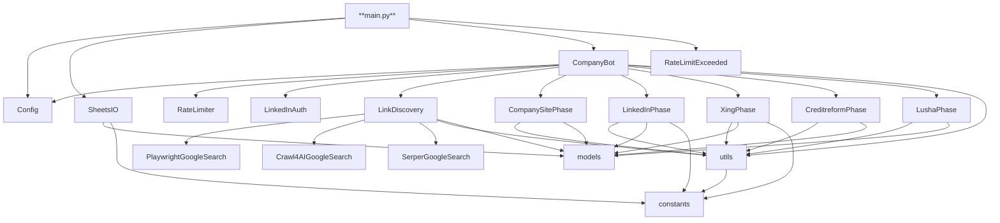

# Architektur-Diagramm – BK-Automatisierung

## 1. Gesamter Verarbeitungsfluss (Lead-Pipeline)

```mermaid
flowchart TD
    START(["`**main.py**
    main()`"]) --> CFG["`**Config**
    config.yaml + .env laden
    Modus setzen`"]
    CFG --> SHEETS_R["`**SheetsIO**
    read_leads()
    Leads filtern nach Unternehmen
    Skip bereits verarbeitete`"]
    SHEETS_R --> RL_CHECK{"`**RateLimiter**
    can_proceed('linkedin')?`"}
    RL_CHECK -- Limit erreicht --> EXIT_RL([Bot beendet\nZeit bis Reset anzeigen])
    RL_CHECK -- OK --> BOT_INIT["`**CompanyBot**
    __init__()
    Alle 5 Phasen initialisieren`"]
    BOT_INIT --> LOOP["`Für jeden Lead:
    process_lead(lead)`"]

    LOOP --> DISC["`**LinkDiscovery**
    discover_urls(lead)`"]
    DISC --> SEARCH{Welcher\nSearch-Provider?}
    SEARCH -- use_serper=true --> SERPER["`**SerperGoogleSearch**
    search(query) → API-Call`"]
    SEARCH -- use_crawl4ai=true --> C4AI["`**Crawl4AIGoogleSearch**
    search_async(query)
    _parse_google_results(html)`"]
    SEARCH -- Default --> PLAYWRIGHT_SEARCH["`**PlaywrightGoogleSearch**
    search(query)
    _handle_consent()`"]
    SERPER & C4AI & PLAYWRIGHT_SEARCH --> VALIDATE["`_validate_result()
    URL-Pattern + Name-Match prüfen
    normalize_string_for_matching()`"]
    VALIDATE --> URLS["`URLs gefunden:
    company / linkedin / xing / creditreform`"]

    URLS --> BROWSER["`Browser starten
    __enter__()
    linkedin_auth.load_session()`"]

    BROWSER --> PH1["`**Phase 1: CompanySitePhase**
    _phase1_company_site()`"]
    PH1 --> P1_RATE[rate_limiter.wait_if_needed]
    P1_RATE --> P1_NAV[page.goto URL]
    P1_NAV --> P1_STUFE["`_extract_stufe()
    CSS-Selektoren aus Config
    categorize_stufe() prüfen`"]
    P1_NAV --> P1_TEL["`_extract_telefonnummern()
    _build_kontakt_url()
    _build_impressum_url()
    _collect_tel_links()`"]
    P1_STUFE & P1_TEL --> P1_FLAGS{"`Flags setzen:
    telefonnummer_gefunden?
    stufe_gefunden?`"}

    P1_FLAGS -- tel+stufe fehlen --> PH2["`**Phase 2: LinkedInPhase**
    _phase2_linkedin()`"]
    PH2 --> LI_AUTH{"`**LinkedInAuth**
    is_logged_in()?`"}
    LI_AUTH -- Nein --> LI_LOGIN["`login()
    E-Mail + Passwort eingeben
    _handle_challenge() bei 2FA`"]
    LI_LOGIN --> LI_SESSION["`_save_session()
    Cookies speichern`"]
    LI_AUTH -- Ja --> LI_PROC
    LI_SESSION --> LI_PROC
    LI_PROC["`rate_limiter.acquire('linkedin')
    page.goto Profil-URL`"]
    LI_PROC --> LI_HEADLINE["`_extract_stufe_from_headline()
    Headline-Selektoren
    categorize_stufe()`"]
    LI_PROC --> LI_ENTRY["`_find_company_entry()
    XPath-Suche nach Firmen-li
    nested Sub-Positionen prüfen`"]
    LI_ENTRY --> LI_AKTIV["`_check_active_status()
    check_active_status() → heute/present`"]
    LI_AKTIV -- inaktiv & keine Company-URL --> SET_INACTIVE["`_set_inactive_status()
    Status=Wechsel / Tel=n/a`"]
    LI_AKTIV -- aktiv --> LI_STUFE["`_extract_stufe()
    aria-hidden span-Selektoren
    Zeilenweise Fallback`"]
    LI_STUFE --> LI_TEL["`_extract_contact_info()
    Contact Info Modal öffnen
    Phone XPath suchen
    _extract_from_website() Fallback`"]

    LI_TEL --> PH3["`**Phase 3: XingPhase**
    _phase3_xing()`"]
    PH3 --> X_RATE[rate_limiter.acquire]
    X_RATE --> X_ENTRY["`_find_company_entry()
    XPath: href contains firma
    ancestor mit h4`"]
    X_ENTRY --> X_AKTIV["`_check_active_status()
    check_active_status()`"]
    X_AKTIV -- inaktiv & kein LinkedIn-Confirm --> SET_INACTIVE
    X_AKTIV -- aktiv --> X_STUFE["`_extract_stufe()
    h4[data-mds=Headline]
    evaluate JS Fallback`"]

    X_STUFE --> PH4_CHECK{"`tel fehlt
    und stufe vorhanden?`"}
    PH4_CHECK -- Ja --> PH4["`**Phase 4: CreditreformPhase**
    _phase4_creditreform()`"]
    PH4 --> CR_RATE[rate_limiter.wait_if_needed]
    CR_RATE --> CR_NAV[page.goto Creditreform-URL]
    CR_NAV --> CR_TEL["`_extract_telefonnummer()
    #kontakt Container
    .adress-white Elemente
    is_valid_phone() prüfen`"]

    PH4_CHECK -- Nein --> PH5_CHECK
    CR_TEL --> PH5_CHECK{"`tel oder stufe\nnoch fehlend?`"}
    PH5_CHECK -- Ja --> PH5["`**Phase 5: LushaPhase**
    _phase5_lusha()
    Außerhalb Browser-Kontext`"]
    PH5 --> LUSHA_API["`Lusha REST API
    GET /v2/person
    firstName, lastName, companyName
    linkedinUrl (optional)`"]
    LUSHA_API --> LUSHA_PARSE["`phoneNumbers extrahieren
    jobTitle categorize_stufe()
    Status 404/429/451/412 behandeln`"]

    LUSHA_PARSE --> OUTPUT["`**_apply_output_logic()**
    Appendix A Mapping`"]
    SET_INACTIVE --> OUTPUT
    OUTPUT --> SCOPE{Stufe bekannt?}
    SCOPE -- In Scope --> ZIELGRUPPE_IN[Zielgruppe = In Scope]
    SCOPE -- Out of Scope --> ZIELGRUPPE_OUT["`Zielgruppe = Out of Scope
    Status = ungültig`"]
    SCOPE -- unbekannt --> SCENARIOS["`Szenario 2-5:
    Telefon ohne Stufe → Unbekannt
    Stufe ohne Tel → garkeine
    Weder noch → Unbekannt/n/a`"]
    ZIELGRUPPE_IN & ZIELGRUPPE_OUT & SCENARIOS --> WRITE["`**SheetsIO**
    write_single_result()
    write_results()
    Zellen farbig formatieren`"]
    WRITE --> NEXT_LEAD{Nächster Lead?}
    NEXT_LEAD -- Ja --> LOOP
    NEXT_LEAD -- Nein --> DONE([Bot beendet])
```



---

## 2. Klassenstruktur und Methoden

```mermaid
classDiagram
    direction TB

    class Config {
        +str mode
        +_config: dict
        +__init__(config_path, mode)
        +get(key, default) Any
        +get_env(key, default) str
        +get_limit(platform, limit_type, default) Any
        +company_config() Dict
        +company_name() str
        +lusha_company_name() str
        +company_aliases() List~str~
        +valid_stufen() Dict
        +company_url_pattern() str
        +company_selectors() Dict
        +company_suffixes() Dict
        +sheet_id() str
        +linkedin_email() str
        +linkedin_password() str
    }

    class SheetsIO {
        +config: Config
        +sheet_id: str
        +sheet_name: str
        +service: Resource
        +company_aliases: List~str~
        +__init__(config)
        -_authenticate() Resource
        +read_leads() List~Lead~
        +write_single_result(result)
        +write_results(results)
    }

    class RateLimiter {
        +config: Config
        +state_file: Path
        +state: Dict
        +__init__(config)
        -_load_state() Dict
        -_save_state()
        -_reset_if_needed(platform)
        +can_proceed(platform) bool
        +get_time_until_reset(platform) dict
        +wait_if_needed(platform)
        +record_request(platform)
        +acquire(platform)
    }

    class RateLimitExceeded {
        +platform: str
        +time_until_reset
        +current_count: int
        +limit: int
        +hours_remaining: int
        +minutes_remaining: int
        +get_formatted_message() str
    }

    class LinkedInAuth {
        +config: Config
        +email: str
        +password: str
        +state_dir: Path
        +__init__(config)
        +login(context, page) bool
        -_handle_challenge(page) bool
        +is_logged_in(page, profile_url) bool
        -_profile_content_visible(page) bool
        +load_session(context) bool
        -_save_session(context)
    }

    class SearchProvider {
        <<abstract>>
        +search(query) List~SearchResult~
    }

    class PlaywrightGoogleSearch {
        +config: Config
        +rate_limiter: RateLimiter
        +__enter__()
        +__exit__(...)
        -_handle_consent()
        +search(query) List~SearchResult~
    }

    class Crawl4AIGoogleSearch {
        +config: Config
        +rate_limiter: RateLimiter
        +search_async(query) List~SearchResult~
        -_parse_google_results(html) List~SearchResult~
        +search(query) List~SearchResult~
    }

    class SerperGoogleSearch {
        +config: Config
        +rate_limiter: RateLimiter
        +api_key: str
        +search(query) List~SearchResult~
    }

    class LinkDiscovery {
        +config: Config
        +rate_limiter: RateLimiter
        +company_domain: str
        +company_name: str
        +url_patterns: dict
        +__init__(config, rate_limiter)
        +discover_urls(lead) dict
        -_run_search(provider, queries, urls, lead)
        -_build_queries(lead) dict
        -_validate_result(results, platform, lead) str
    }

    class BasePhase {
        +config: Config
        +rate_limiter: RateLimiter
        +platform: str
        +valid_stufen: Dict
        +__init__(config, rate_limiter, platform)
        +navigate_with_rate_limit(page, url) bool
        +safe_query_selector(element, selector) Any
        +safe_query_selector_all(element, selector) List
        +safe_inner_text(element, default) str
    }

    class CompanySitePhase {
        +config: Config
        +rate_limiter: RateLimiter
        +valid_stufen: Dict
        +selectors: Dict
        +suffixes: Dict
        +process(page, url, lead, flags) Tuple
        -_extract_stufe(page) str
        -_extract_telefonnummern(page, base_url, lead) List~str~
        -_collect_tel_links(page) List~str~
        -_build_kontakt_url(base_url) str
        -_build_impressum_url(base_url) str
    }

    class LinkedInPhase {
        +config: Config
        +rate_limiter: RateLimiter
        +valid_stufen: Dict
        +company_name: str
        +process(page, url, lead, flags) Tuple
        -_find_company_entry(page) Element
        -_check_active_status(entry) bool
        -_extract_stufe(entry) str
        -_extract_stufe_from_headline(page) str
        -_extract_contact_info(page, lead) List~str~
        -_extract_from_website(page, lead) List~str~
    }

    class XingPhase {
        +config: Config
        +rate_limiter: RateLimiter
        +valid_stufen: Dict
        +company_name: str
        +process(page, url, lead, flags) Tuple
        -_find_company_entry(page) Element
        -_check_active_status(entry) bool
        -_extract_stufe(entry) str
    }

    class CreditreformPhase {
        +config: Config
        +rate_limiter: RateLimiter
        +process(page, url, lead, flags) List~str~
        -_extract_telefonnummer(page) List~str~
    }

    class LushaPhase {
        +config: Config
        +rate_limiter: RateLimiter
        +valid_stufen: Dict
        +api_key: str
        +process(lead, flags, linkedin_url, need_phone, need_stufe) Tuple
    }

    class CompanyBot {
        +config: Config
        +rate_limiter: RateLimiter
        +linkedin_auth: LinkedInAuth
        +company_site_phase: CompanySitePhase
        +linkedin_phase: LinkedInPhase
        +xing_phase: XingPhase
        +creditreform_phase: CreditreformPhase
        +lusha_phase: LushaPhase
        +playwright, browser, context, page
        +linkedin_logged_in: bool
        +__enter__()
        +__exit__(...)
        +process_lead(lead) LeadResult
        -_set_inactive_status(result)
        -_phase1_company_site(result, flags) Tuple
        -_phase2_linkedin(result, flags) Tuple
        -_phase3_xing(result, flags) Tuple
        -_phase4_creditreform(result, flags) List
        -_phase5_lusha(result, flags, ...) Tuple
        -_apply_output_logic(result)
    }

    class Lead {
        +vorname: str
        +nachname: str
        +unternehmen: str
        +row_number: int
        +full_name() str
    }

    class LeadResult {
        +lead: Lead
        +telefonnummer: str
        +zweite_telefonnummer: str
        +stufe: str
        +status: str
        +zielgruppe: str
        +tel_quelle: str
        +target_url_company: str
        +target_url_linkedin: str
        +target_url_xing: str
        +target_url_creditreform: str
    }

    class SearchResult {
        +title: str
        +url: str
        +snippet: str
    }

    class ProcessingFlags {
        +nur_status_check: bool
        +nur_stufe_suchen: bool
        +status_check_weiter_creditreform: bool
        +stufe_suchen_weiter_creditreform: bool
        +nur_stufe_suchen_status_active_confirmed: bool
        +status_active_confirmed: bool
        +telefonnummer_gefunden: bool
        +stufe_gefunden: bool
    }

    SearchProvider <|-- PlaywrightGoogleSearch
    SearchProvider <|-- Crawl4AIGoogleSearch
    SearchProvider <|-- SerperGoogleSearch

    RateLimitExceeded --|> Exception

    CompanyBot --> Config
    CompanyBot --> RateLimiter
    CompanyBot --> LinkedInAuth
    CompanyBot --> CompanySitePhase
    CompanyBot --> LinkedInPhase
    CompanyBot --> XingPhase
    CompanyBot --> CreditreformPhase
    CompanyBot --> LushaPhase
    CompanyBot --> LinkDiscovery

    SheetsIO --> Config
    SheetsIO ..> Lead : liest
    SheetsIO ..> LeadResult : schreibt

    RateLimiter --> RateLimitExceeded : wirft

    LinkDiscovery --> PlaywrightGoogleSearch
    LinkDiscovery --> Crawl4AIGoogleSearch
    LinkDiscovery --> SerperGoogleSearch
    LinkDiscovery ..> SearchResult : nutzt

    CompanySitePhase --> RateLimiter
    LinkedInPhase --> RateLimiter
    XingPhase --> RateLimiter
    CreditreformPhase --> RateLimiter
    LushaPhase --> RateLimiter

    CompanyBot ..> Lead : verarbeitet
    CompanyBot ..> LeadResult : erstellt
    CompanyBot ..> ProcessingFlags : steuert Phasen
```



---

## 3. Datenfluss-Übersicht (vereinfacht)

```mermaid
flowchart LR
    GS[(Google Sheets\nInput)] -->|read_leads()| LEAD[Lead\nvorname/nachname\nunternehmen]
    LEAD -->|discover_urls()| URLS[4 URLs\ncompany/linkedin\nxing/creditreform]
    URLS -->|Phase 1| P1[Firmenseite\nStufe + Tel]
    URLS -->|Phase 2| P2[LinkedIn\nStufe + Tel + aktiv?]
    URLS -->|Phase 3| P3[Xing\nStufe + aktiv?]
    URLS -->|Phase 4| P4[Creditreform\nTel]
    URLS -->|Phase 5| P5[Lusha API\nTel + Stufe]
    P1 & P2 & P3 & P4 & P5 -->|_apply_output_logic()| RESULT[LeadResult\ntelefonnummer\nstufe\nzielgruppe\nstatus\ntel_quelle]
    RESULT -->|write_results()| GS2[(Google Sheets\nOutput\nfarbig formatiert)]
```

---

## 4. Rate-Limiting-Logik

```mermaid
flowchart TD
    ACQ[acquire(platform)] --> CAN{can_proceed?}
    CAN -- Nein --> THROW[RateLimitExceeded\nwerfen]
    CAN -- Ja --> WAIT[wait_if_needed\nrandom Delay min/max]
    WAIT --> REC[record_request\nCounter erhöhen\nState in JSON speichern]
    REC --> DONE[Weiter]

    subgraph RESETS["_reset_if_needed()"]
        LI_DAY["LinkedIn: 24h-Fenster\nday_window_start prüfen"]
        LI_HOUR["LinkedIn + Xing:\nStundenlimit zurücksetzen"]
    end

    subgraph COUNTERS["Plattform-Zähler"]
        C1["LinkedIn: daily + hourly\nPause nach N Profilen"]
        C2["Xing: hourly"]
        C3["Tecis/Creditreform/Google:\nnur Delay (kein Counter-Limit)"]
    end
```

---

## 5. Modul-Abhängigkeiten


